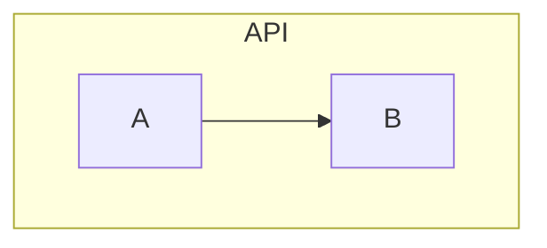
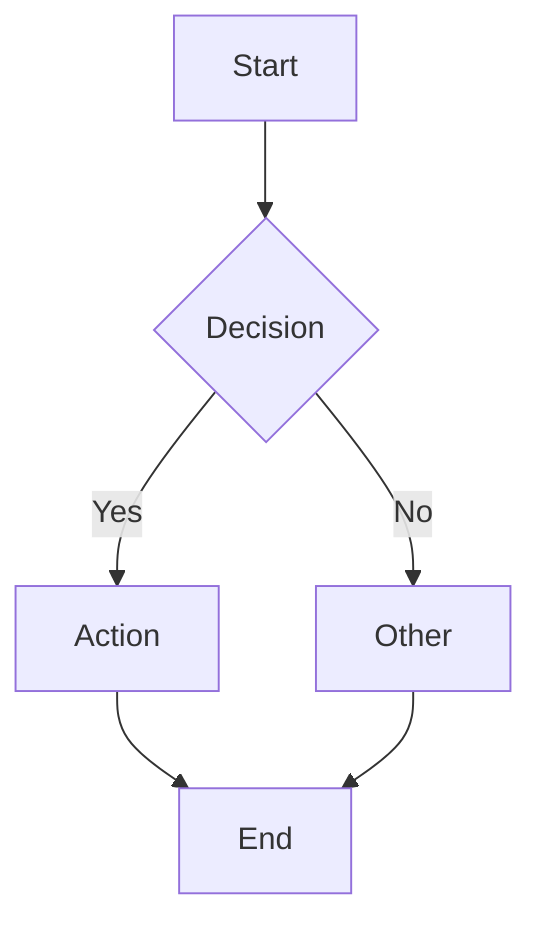
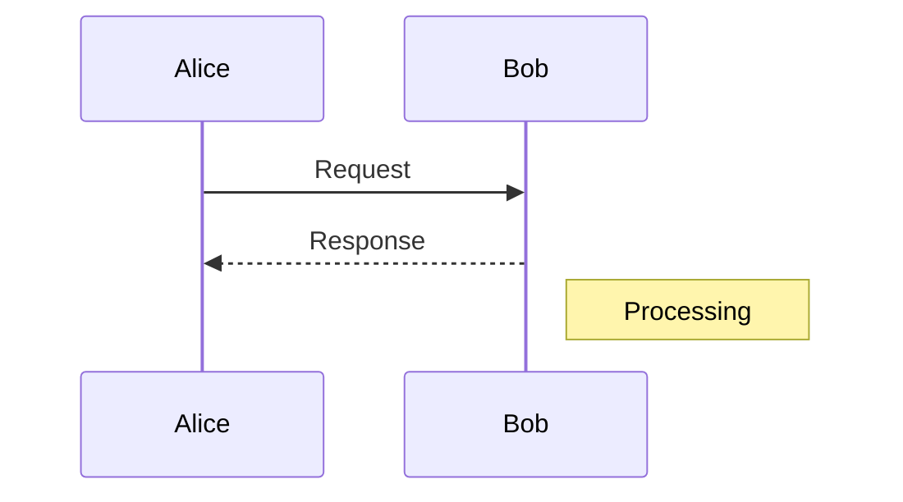
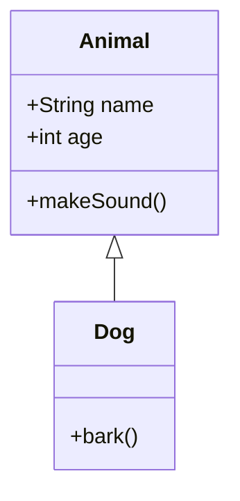
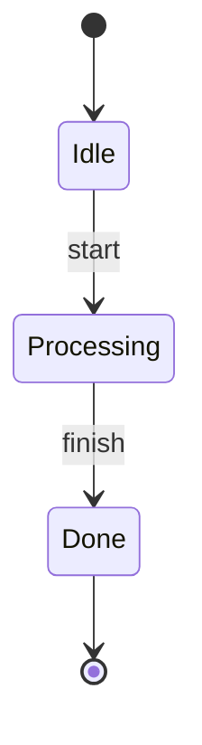
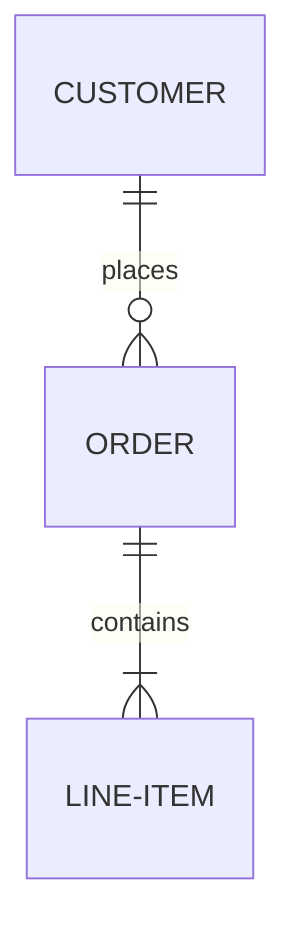

# Mermaid Diagram Skill

Create syntactically correct Mermaid diagrams with validation.

## Common Pitfalls (Read These First!)

### 1. Parentheses in Labels
❌ **Wrong:** `A(Click here)` - Parentheses are syntax, not display characters
✅ **Correct:** `A[Click here]` or `A("Click here")` - Use brackets or quoted text

### 2. Spaces in Node IDs
❌ **Wrong:** `User Service --> Database`
✅ **Correct:** `UserService --> Database` or `US["User Service"] --> DB`

### 3. Unescaped Quotes
❌ **Wrong:** `A[He said "hello"]`
✅ **Correct:** `A["He said 'hello'"]` or `A[He said hello]`

### 4. Wrong Arrow Types
❌ **Wrong:** `A -> B` in flowchart (that's for sequence diagrams)
✅ **Correct:** `A --> B` in flowchart

### 5. Missing Direction
❌ **Wrong:** Starting with `A --> B`
✅ **Correct:** `graph TD` or `graph LR` first, then `A --> B`

### 6. Special Characters Breaking Syntax
❌ **Wrong:** `A[Cost: $100]` - Dollar signs can break parsing
✅ **Correct:** `A["Cost: $100"]` - Quote the label

### 7. Wrong Bracket Types for Shapes
- `A[Rectangle]` - Rectangle
- `A(Round edges)` - Round edges (NOT for display text!)
- `A{Diamond}` - Diamond
- `A([Stadium])` - Stadium
- `A[[Subroutine]]` - Subroutine
- `A[(Database)]` - Cylinder

### 8. Subgraph Syntax
❌ **Wrong:** Missing `end` statement
✅ **Correct:**


## Diagram Types Quick Reference

### Flowchart


**Arrows:** `-->` (solid), `-.->` (dotted), `==>` (thick)
**Direction:** `TD` (top-down), `LR` (left-right), `RL`, `BT`

### Sequence Diagram


**Arrows:** `->>` (solid), `-->>` (dotted), `-x` (async)

### Class Diagram


### State Diagram


### ER Diagram


**Relationships:** `||--o{` (one-to-many), `||--||` (one-to-one), `}o--o{` (many-to-many)

## Workflow

1. **Create complete diagram** following pitfall guidelines above
2. **Preflight validator path** once per session:
   ```bash
   MERMAID_SKILL_DIR="${CODEX_HOME:-$HOME/.codex}/skills/mermaid"
   test -x "$MERMAID_SKILL_DIR/scripts/validate.py"
   ```
3. **ALWAYS validate** before writing to file:
   ```bash
   MERMAID_SKILL_DIR="${CODEX_HOME:-$HOME/.codex}/skills/mermaid"
   echo "graph TD..." | "$MERMAID_SKILL_DIR/scripts/validate.py"
   ```
4. **If validation fails:** Debug incrementally (see `validation.md`)

**Validate file:** Use `--file diagram.mmd` flag if diagram already written.

**See:** `validation.md` for validation setup and debugging workflow.

## Best Practices

1. **Always quote complex labels:** `A["Complex: text (with) special chars"]`
2. **Use semantic IDs:** `UserService` not `A`, `B`, `C`
3. **Validate complete diagrams:** Not each section, only final result
4. **Avoid special chars in IDs:** Stick to alphanumeric + underscores
5. **One statement per line:** Easier to debug when validation fails

## Storing Validated Diagrams

Store in Graphiti for cross-session persistence:

```bash
# 1. Create and validate diagram text
MERMAID_SKILL_DIR="${CODEX_HOME:-$HOME/.codex}/skills/mermaid"
DIAGRAM="graph TD
    A[Start] --> B[End]"
echo "$DIAGRAM" | "$MERMAID_SKILL_DIR/scripts/validate.py"

# 2. If valid, store (if Graphiti skill available)
GRAPHITI_DIR="${CODEX_HOME:-$HOME/.codex}/skills/graphiti"
if [ -x "$GRAPHITI_DIR/scripts/run.sh" ]; then
  "$GRAPHITI_DIR/scripts/run.sh" add "$DIAGRAM" \
    --group codebase --entity-types Diagram Flowchart
else
  echo "Graphiti not available; skip storage"
fi
```

Retrieve later with `search "query" --entity-types Diagram` to filter for diagrams only.

## When Diagrams Fail

If validation fails:
1. Check for unquoted labels with special characters
2. Verify all subgraphs have `end` statements
3. Ensure arrow syntax matches diagram type
4. Look for spaces in node IDs
5. Check bracket balance

## Troubleshooting

- **"Parse error"**: Check syntax - missing quotes, wrong arrows, unbalanced brackets
- **"Invalid direction"**: Add `graph TD` or `graph LR` at start
- **"Unexpected token"**: Special character not escaped - wrap label in quotes
- **Renders blank**: Node ID has spaces or invalid characters
